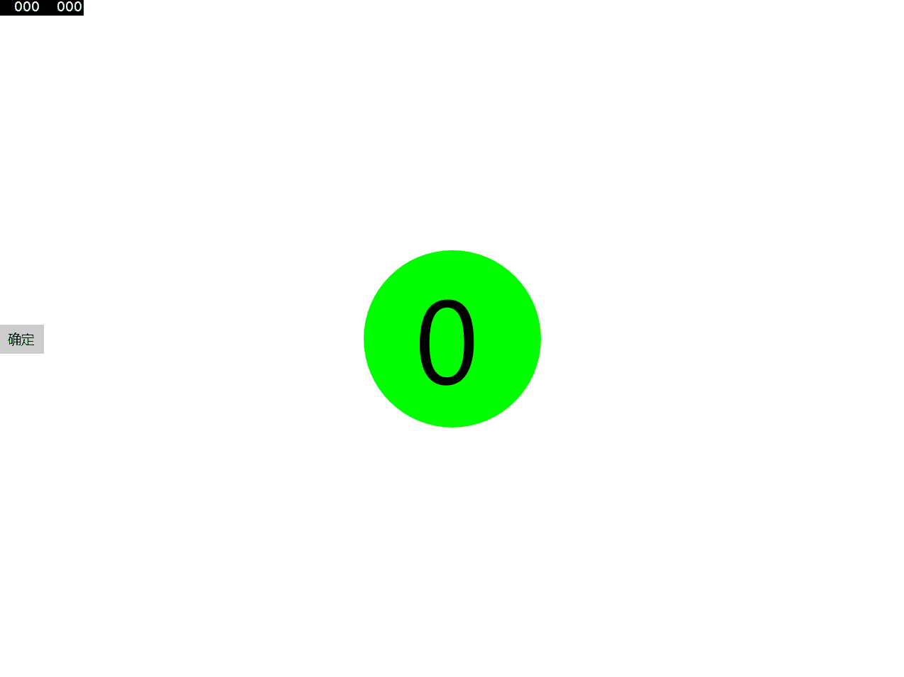

# UWP

[中文](#中文)
[English](#English)

| Package Name                   | Release (NuGet) | 
|--------------------------------|-----------------|
|  `lindexi.uwp.Framework`       |[](https://www.nuget.org/packages/lindexi.uwp.Framework/)|
|  `lindexi.MVVM.Framework`      |[](https://www.nuget.org/packages/lindexi.MVVM.Framework/)|
|  `lindexi.wpf.Framework`       |[](https://www.nuget.org/packages/lindexi.wpf.Framework/)|
|  `Lindexi.Src.GitCommand`       |[](https://www.nuget.org/packages/Lindexi.Src.GitCommand/)|
|  `Lindexi.Src.GitCommand.Source`       |[](https://www.nuget.org/packages/Lindexi.Src.GitCommand.Source/)|
|  [`Lindexi.Tool.AutoSyncGitRepo`](package/AutoSyncGitRepo/README.md)       |[](https://www.nuget.org/packages/Lindexi.Tool.AutoSyncGitRepo/)|
|  [`Lindexi.Control.WPFFlipDrawingCanvas`](wpf/WPFFlipDrawingCanvas)       |[](https://www.nuget.org/packages/Lindexi.Control.WPFFlipDrawingCanvas)|

# 中文

常用代码和控件

## 控件

 - [手绘对称图形控件 仅 WPF 可用](wpf/WPFFlipDrawingCanvas)

 [](https://www.nuget.org/packages/Lindexi.Control.WPFFlipDrawingCanvas)

 

 - [白天黑夜按钮](uwp/control/NightDayThemeToggleButton)

 

 - [进度条](uwp/control/Progress)

 - [变大数字颜色按钮](uwp/control/RountGradualFigure)

 

 - [按下等待按钮](uwp/control/Button)

 

## 软件

### [win10 uwp 水印图床](uwp/control/BitStamp)

参见 ：[win10 uwp 水印图床](https://blog.csdn.net/lindexi_gd/article/details/52808347?utm_source=blogxgwz5)

[安装](ms-windows-store://pdp/?productid=9nblggh562r2) https://www.microsoft.com/store/apps/9nblggh562r2

### [使用 Pandoc 将 Markdown 转 Docx 文件](wpf/PandocMarkdown2Docx)


[点击下载](https://github.com/lindexi/UWP/releases/tag/PandocMarkdown2Docx_1.0)

### MatterMost 博客RSS订阅服务

代码 [博客订阅](./src/博客订阅)

使用方法，用 docker 发布

```csharp
docker build .
```

然后 post 内容作为 json 写明需要订阅的博客和对应的 MatterMost 链接

```csharp
{
    "MatterMostUrl": "http://mattermost.lindexi.com/hooks/sd7rhrij9ty98kerzdu8pfrbcy",
    "BlogList": 
    [
      "https://blog.lindexi.com/feed.xml", 
      "https://blog.lindexi.com/feed.xml",
      "http://feed.cnblogs.com/blog/u/148394/rss/", 
      "https://blog.walterlv.com/feed.xml", 
      "https://xinyuehtx.github.io/feed.xml", 
      "http://feed.cnblogs.com/blog/u/261865/rss/", 
      "http://feed.cnblogs.com/blog/u/481512/rss/", 
      "https://blog.sdlsj.net/feed/", 
      "http://feed.cnblogs.com/blog/u/113198/rss/", 
      "http://feed.cnblogs.com/blog/u/114368/rss/", 
      "http://feed.cnblogs.com/blog/u/138780/rss/", 
      "https://blog.ultrabluefire.cn/feed/", 
      "https://codedefault.com/rss/sn.xml", 
      "http://feed.cnblogs.com/blog/u/42514/rss/", 
      "https://www.itmangoto.cn/feed/", 
      "http://feed.cnblogs.com/blog/u/325447/rss/", 
      "http://feed.cnblogs.com/blog/u/552614/rss/", 
      "https://yangshunjie.com/rss.xml", 
      "http://feed.cnblogs.com/blog/u/127175/rss/"
    ]
}
```

将内容推送到 `http://ip/api/rss` 请将 ip 替换为 docker 运行的 ip 地址

多次推送内容会添加订阅博客

注意：我用的是内存数据库，关闭容器将会丢失订阅配置

### [EncryptionSyncFolder](app/EncryptionSyncFolder)

win10 uwp 同步文件夹

## 代码

 - [DetailMaster](uwp/src/DetailMaster)

 - [图床](uwp/src/Imageshack)

   图床是把图片上传到云，然后获取图片链接的开发包，我将繁琐的过程写成一个简单的类。
   上传的服务器现在有[sm.ms](https://sm.ms/)和[七牛图床](http://www.qiniu.com/)。其中[七牛sdk UWP](uwp/src/Imageshack/cloundes)，
   我只有简单文件上传，好多还没写。

   七牛图床上传到Nuget，搜索`lindexi.uwp.ImageShack.Thirdqiniucs`或
   控制台`Install-Package lindexi.uwp.ImageShack.Thirdqiniucs`

 - [显示svg](uwp/src/ScalableVectorGraphic)

 - [SplitView](uwp/src/SplitView)
   
   汉堡菜单

 - [ViewModel](uwp/src/ViewModel)

 - [隐私策略](uwp/src/隐私策略)

 - [径向规](uwp/src/RadialGauge)

 - 图片存放本地
   
   输入Uri打开，第一次从网络打开，之后在本地打开。

   先判断本地存在图片，不存在就从网络下载

   `BitmapImage img = await ImageStorage.GetImage(uri);`

   上传到Nuget，可以搜索`lindexi.uwp.src.ImageStorage `或控制台
   `Install-Package lindexi.uwp.src.ImageStorage`

 - [修改CalendarDatePicker图标颜色](uwp/src/CalendarDatePickerForeground)

 - [UWP 笔迹识别](uwp/src/Ink)

### [轻量 MVVM 框架](uwp/src/Framework)

提供轻量的 MVVM 框架，可以在 WPF 和 UWP 使用

| Package Name                   | Release (NuGet) | 
|--------------------------------|-----------------|
|  `lindexi.uwp.Framework`       |[](https://www.nuget.org/packages/lindexi.uwp.Framework/)|
|  `lindexi.MVVM.Framework`      |[](https://www.nuget.org/packages/lindexi.MVVM.Framework/)|
|  `lindexi.wpf.Framework`       |[](https://www.nuget.org/packages/lindexi.wpf.Framework/)|

如果是 UWP 程序，通过 NuGet 安装方法如下

```csharp
Install-Package lindexi.uwp.Framework
```

如果是 WPF 程序，通过 NuGet 安装方法如下

```csharp
Install-Package lindexi.wpf.Framework
```

如果是 Xamarin 项目，可以只安装 lindexi.MVVM.Framework 但是要求项目支持 .NETStandard 2.0 以上

参见：

[win10 uwp MVVM入门](https://lindexi.gitee.io/post/win10-uwp-MVVM%E5%85%A5%E9%97%A8.html )

[win10 uwp MVVM 轻量框架](https://lindexi.gitee.io/post/win10-uwp-MVVM-%E8%BD%BB%E9%87%8F%E6%A1%86%E6%9E%B6.html )

[WPF 轻量级 MVVM 框架入门 2.1.2](https://lindexi.gitee.io/post/WPF-%E8%BD%BB%E9%87%8F%E7%BA%A7-MVVM-%E6%A1%86%E6%9E%B6%E5%85%A5%E9%97%A8-2.1.2.html )

[win10 uwp 轻量级 MVVM 框架入门 2.1.5.3199](https://lindexi.gitee.io/post/win10-uwp-%E8%BD%BB%E9%87%8F%E7%BA%A7-MVVM-%E6%A1%86%E6%9E%B6%E5%85%A5%E9%97%A8-2.1.5.3199.html )


 
### [WPF 跨线程 UI 的方法](wpf/CaitrairSodeyatarFowfurur)

通过 VisualTraget 在 WPF 使用多个 UI 线程

参见：[WPF 跨线程 UI 的方法](https://lindexi.github.io/lindexi/post/WPF-%E8%B7%A8%E7%BA%BF%E7%A8%8B-UI-%E7%9A%84%E6%96%B9%E6%B3%95.html )

# English

Some controls and common codes

This rep is not finished yet, and I don't know when I will make it...

